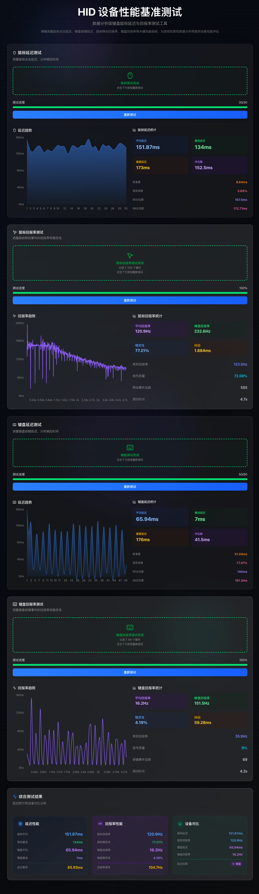

# 输入响应测试器

一个用于测试键盘和鼠标输入延迟及回报率的现代化 Web 应用程序。

[!example.png(./public/example.png)]

[](./public/example.png)

## 功能特性

### 延迟测试

- **鼠标延迟测试**：测量鼠标点击的响应时间，进行 30 次测试并提供详细统计分析
- **键盘延迟测试**：测量键盘按键的响应时间，进行 50 次测试并提供详细统计分析

### 回报率测试

- **鼠标回报率测试**：通过 5 秒钟的鼠标移动测试，分析鼠标的回报率性能
- **键盘回报率测试**：通过连续按键测试，分析键盘的回报率性能

### 数据分析

- 实时统计分析（平均值、最小值、最大值、标准差）
- 可视化图表展示测试结果
- 综合性能分析报告
- 设备性能对比

## 技术栈

- **框架**：Next.js 15.3.3 (React 19)
- **语言**：TypeScript
- **样式**：Tailwind CSS 4
- **UI 组件**：Radix UI
- **图表**：Recharts
- **图标**：Lucide React
- **构建工具**：Turbopack

## 快速开始

### 环境要求

- Node.js 18+
- pnpm (推荐) 或 npm

### 安装依赖

```bash
pnpm install
```

### 开发模式

```bash
pnpm dev
```

应用将在 [http://localhost:3000](http://localhost:3000) 启动。

### 构建生产版本

```bash
pnpm build
pnpm start
```

## 使用说明

### 延迟测试

1. **鼠标延迟测试**

   - 点击"开始鼠标测试"按钮
   - 当屏幕变色时立即点击鼠标
   - 重复 30 次测试
   - 查看详细的统计结果

2. **键盘延迟测试**
   - 点击"开始键盘测试"按钮
   - 当屏幕变色时立即按下任意键
   - 重复 50 次测试
   - 查看详细的统计结果

### 回报率测试

1. **鼠标回报率测试**

   - 点击"开始鼠标移动测试"按钮
   - 在 5 秒内持续移动鼠标
   - 系统自动分析鼠标回报率

2. **键盘回报率测试**
   - 点击"开始键盘回报率测试"按钮
   - 在测试期间连续按键
   - 系统自动分析键盘回报率

## 项目结构

```
src/
├── app/                    # Next.js 应用目录
│   ├── page.tsx           # 主页面
│   ├── layout.tsx         # 布局组件
│   └── globals.css        # 全局样式
├── components/            # React 组件
│   ├── test-section.tsx   # 延迟测试组件
│   ├── report-rate-test-section.tsx  # 回报率测试组件
│   ├── performance-stats.tsx         # 性能统计组件
│   ├── overall-analysis.tsx          # 综合分析组件
│   └── ui/                # UI 基础组件
└── lib/                   # 工具函数
    └── stats-utils.ts     # 统计计算工具
```

## 开发脚本

- `pnpm dev` - 启动开发服务器（使用 Turbopack）
- `pnpm build` - 构建生产版本
- `pnpm start` - 启动生产服务器
- `pnpm lint` - 运行 ESLint 检查

## 特色功能

- 🎯 **精确测量**：使用高精度时间戳进行延迟测量
- 📊 **实时分析**：即时显示统计数据和可视化图表
- 🎨 **现代界面**：基于 Tailwind CSS 的美观响应式设计
- ⚡ **高性能**：使用 Next.js 和 Turbopack 优化性能
- 📱 **响应式**：支持各种设备和屏幕尺寸
- 🔍 **详细统计**：提供平均值、标准差、最值等详细数据

如果这个项目对您有帮助，请给一个 ⭐ Star！

[](https://www.star-history.com/#evanlong-me/input-response-tester&Date)

---

_专为游戏玩家和硬件爱好者设计的输入设备性能测试工具_
